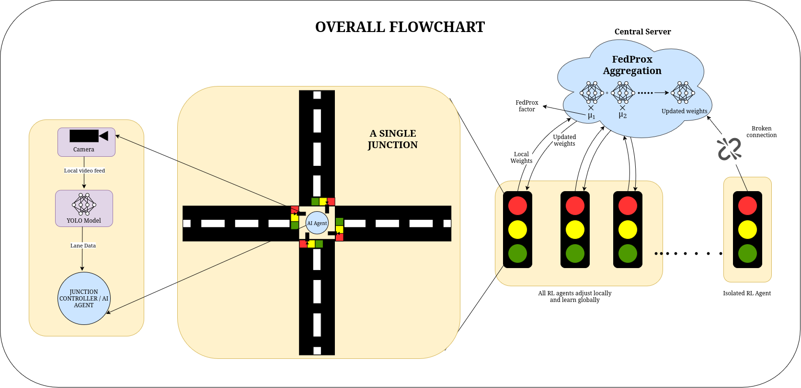
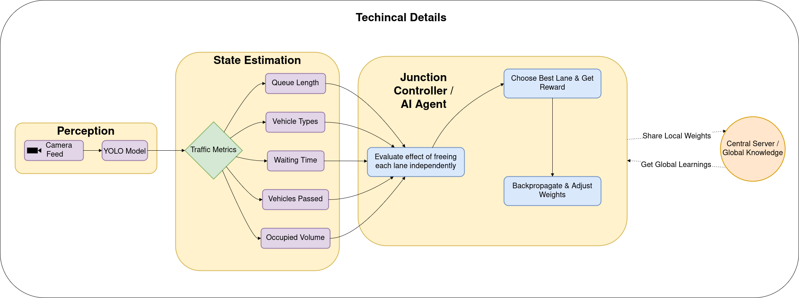
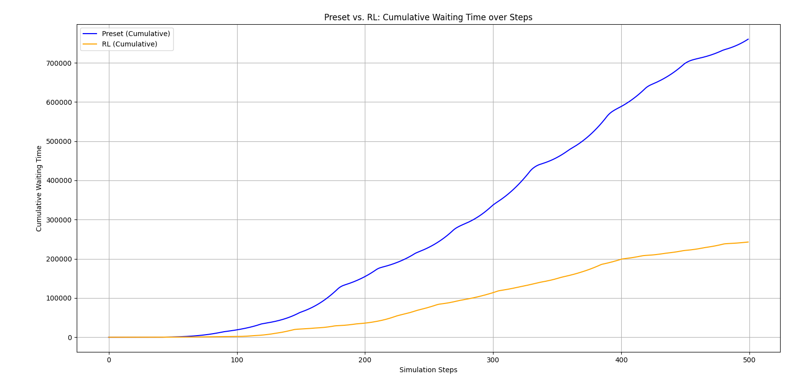
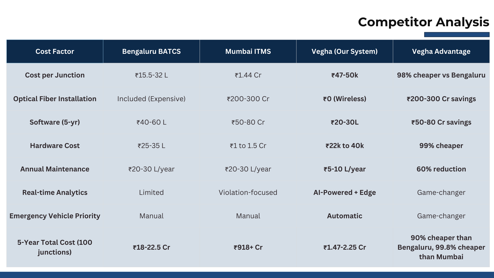

# Vegha: Decentralized Edge-First Traffic Intelligence

> [!Note]
> **🟢 Live Deployment**: This system is currently deployed and active.
> *   **Dashboard**: [vegha.vikasrajyadav.com](https://vegha.vikasrajyadav.com)
> *   **API**: [api.vegha.vikasrajyadav.com](https://api.vegha.vikasrajyadav.com)

## 🚦 Problem Statement: The Gridlock of Indian Cities


Urban traffic in the Global South is chaotic, unstructured, and rapidly expanding. Existing solutions—Adaptive Traffic Control Systems (ATCS)—fail in this context because:

1.  **Centralization Bottlenecks**: They rely on expensive fiber backhauls to central servers. When the network fails, the city creates gridlock.
2.  **Hardware Dependency**: They require proprietary, high-cost sensors (inductive loops, radar) that are impossible to retrofit on aging infrastructure.
3.  **Latency**: Round-trip time to a cloud server prevents real-time reaction to sudden events (accidents, ambulances).

**Vegha solves this by shifting intelligence to the edge.** We don't just "manage" traffic; we create **Autonomous Intersection Agents** that collaborate to optimize flow without a central brain.

---

## 🎥 Demo & Validation

> [!NOTE]
> **Detailed Documentation**: For a complete breakdown of features, architecture, and business validation, refer to our [Presentation Deck (PDF)](resources/vehga_v1.pdf).

### 1. Website Demo: The Full Platform
Vegha is an AI-powered traffic management platform that connects a live SUMO traffic engine to a modern Next.js dashboard, enabling real‑time monitoring of vehicles, signals, and congestion metrics. In this demo, we showcase dynamic maps, live ambulance prioritization, and interactive controls to close or reopen streets during events like accidents or roadworks. You’ll also see how traffic events are created from the dashboard and immediately reflected in the running traffic environment for true city‑scale scenario testing. Built with Socket.IO, Leaflet, and a Flask backend, Vegha demonstrates how reinforcement learning and smart control can transform urban mobility.

<div align="center">
  <a href="https://www.youtube.com/embed/7rYoW2CGFH0?autoplay=1">
    
  </a>
</div>

### 2. Vegha Solving Coldplay Traffic Nightmare
Watch Vegha tackle the massive traffic chaos of a Coldplay concert exit, transforming gridlock into smooth flow with intelligent signal control and dynamic rerouting. Our system prioritizes ambulances through the crowd surge, closes event streets strategically, and optimizes every intersection for maximum throughput. See dramatic improvements in emergency response times, vehicle speeds, and congestion clearance compared to traditional fixed signals. Vegha proves it can handle real-world mega-events with precision and speed.

<div align="center">
  <a href="https://www.youtube.com/embed/Dss-J9jrGe0?autoplay=1">
    
  </a>
</div>

### 3. Edge Computing: Real-World Device Demo
This video demonstrates how edge computing powers Vegha’s intelligent traffic control in a real-world setup using a low-cost device equivalent in cost to our deployed roadside hardware. You’ll see how critical decisions like signal timing, congestion detection, and ambulance prioritization are processed directly at the edge instead of relying on the cloud. The demo highlights reduced latency, higher reliability during network issues, and continuous operation even with limited connectivity. Watch how an affordable on-device deployment can still deliver high-performance, real-time traffic management for smart cities.

<div align="center">
  <a href="https://www.youtube.com/embed/-pVcdBaw4GY?autoplay=1">
    
  </a>
</div>

### 4. Vegha vs. Current Model (Side-by-Side)
This video showcases a side‑by‑side comparison between the existing traffic control approach and our Vegha‑powered model on the same road network and conditions. You’ll see how our system reduces congestion, lowers waiting time, and prioritizes ambulances and emergency vehicles more efficiently than the current setup. The demo highlights key metrics like vehicle throughput, average speed, and signal responsiveness to clearly show performance gains. Watch to understand how intelligent, data‑driven traffic management can transform everyday commuting and emergency response in urban areas.

<div align="center">
  <a href="https://www.youtube.com/embed/V8MBIYzJWPc?autoplay=1">
    
  </a>
</div>

---

## 💻 Deployment & Running Instructions

> [!TIP]
> **Professional Grade Setup**: This system utilizes `docker-compose` for a "one-click" production deployment. Ensure Docker Desktop is running before proceeding.

### Prerequisites
*   Docker & Docker Compose
*   Python 3.8+ (for local scripts)
*   Node.js 18+ (for frontend development)

### Quick Start (Production Mode)

1.  **Clone the Repository**
    ```bash
    git clone https://github.com/vinayakyadav2709/vegha-hackwithwinter
    cd vegha-hackwithwinter
    ```

2.  **Launch the System**
    This command orchestrates the Federated Server, Dashboard, and Map Services.
    ```bash
    docker-compose up --build -d
    ```

3.  **Access Interfaces**
    *   **Traffic Authority Dashboard**: [http://localhost:3000](http://localhost:3000) (or live at `vegha.vikasrajyadav.com`)
    *   **API Documentation**: [http://localhost:5000/api/docs](http://localhost:5000/api/docs) (or live at `api.vegha.vikasrajyadav.com`)

4.  **Connect an Edge Agent** (Optional)
    To connect a physical edge device (Jetson/Pi) or run the software simulation agent:
    ```bash
    cd FDRL
    python federated_client.py --connect wss://api.vegha.vikasrajyadav.com
    ```

---

## 📊 Visual Intelligence & Architecture

### 1. Overall System Architecture
*High-level interaction between Edge Nodes, Server, and Dashboard.*


### 2. System Architecture
*Core architectural components and their connectivity.*


### 3. Technical Implementation
*Deep dive into the technical stack and data flow.*


### 4. Simulation Results
*Performance benchmarks showing wait-time reduction.*


### 5. Competitor Analysis
*Comparison against SCATS, SCOOT, and Fixed-Time systems.*


---

## 📉 Why Existing Systems Fail

| Feature | Traditional ATCS | Vegha (Our Solution) |
| :--- | :--- | :--- |
| **Architecture** | Centralized Server (Single Point of Failure) | **Decentralized & Federated** (Fault-Tolerant) |
| **Connectivity** | Requires High-Bandwidth Fiber | **Low-Bandwidth / Intermittent** (4G/LTE/LoRa) |
| **Data Privacy** | Raw Video Streamed to Cloud | **Privacy-Preserving Design** (Only weights shared) |
| **Scalability** | Linear Cost Increase | **Municipal-Scale Deployment** at Fraction of TCO |
| **Deployment** | Years (Digging roads for cables) | **Retrofit-Friendly** (Deploy in weeks) |

---

## 🏗️ System Architecture & Data Flow

Vegha operates on a **Federated Learning** model where each intersection is an independent learner.

### Data Flow

The system operates on a decentralized model where locally processed insights are shared via lightweight JSON payloads, bypassing the need for video streaming.

---

## 🧩 Edge-First Decentralized Architecture

Our system runs **100% of critical logic at the edge**.

*   **Autonomous Intersection Agents**: Each junction runs a Raspberry Pi/Jetson Nano with a specialized **PPO (Proximal Policy Optimization)** agent.
*   **Local Inference**: Vehicle detection happens locally using optimized **TensorFlow Lite** models. No video leaves the device.
*   **Fault-Tolerant Architecture**: If the central server goes down, intersections continue to function optimally using their last known policy.

---

## 🔒 Federated Learning & Privacy Preservation

We address the critical challenge of privacy in surveillance.

*   **Privacy-Preserving Design**: Raw footage is processed in RAM and discarded. Only **mathematical model gradients** are transmitted to the server.
*   **Collaborative Intelligence**: Intersections "learn" from each other. A busy intersection teaches a quiet one how to handle a sudden surge, without sharing specific vehicle data.
*   **Low-Bandwidth Communication**: We transmit kilobytes (weights), not Gigabytes (video), making this viable for cellular networks in India.

---

## 🚨 Event-Aware Traffic Intelligence

Vegha goes beyond simple signal timing. It understands context.

*   **Emergency Vehicle Prioritization**: Computer vision detects ambulances/fire trucks and preemptively clears the corridor (Green Wave).
*   **Scheduled Events**: "Coldplay Concert" mode pre-configures routes for massive egress, preventing post-event gridlock.
*   **Road Closures and Diversions**: Operators can mark closed roads on the dashboard, and agents instantly reroute traffic flow logic across the neighborhood.
*   **Graceful Degradation**: In case of camera failure, the system falls back to a robust historical timing profile, ensuring safety.

---

## 💰 Cost & Deployment Economics

*   **Brownfield Deployment**: Works with existing CCTV cameras and signal poles. No need to dig up roads.
*   **Low Total Cost of Ownership (TCO)**:
    *   **Hardware**: Off-the-shelf compute ($100 vs $5000 proprietary controllers).
    *   **Connectivity**: Uses standard 4G SIMs instead of dedicated fiber.
*   **API Monetization**: Anonymized traffic density data is exposed via API for logistics companies, ride-sharing apps, and urban planners.

---

## 📈 Scalability & City-Wide Expansion

*   **Zero-Touch Provisioning**: New intersections are auto-discovered. Just power on the device, and it joins the federated network.
*   **Global South Scalability**: Designed specifically for the chaotic, diverse traffic of Indian cities—handling autos, bikes, and cows with equal precision.
*   **SaaS-Based Analytics**: The command center scales horizontally on the cloud, managing 10 to 10,000 intersections seamlessly.

---

## 🚀 Future Scope (Round 2 Improvements)

We have a clear roadmap to move from prototype to pilot, focusing on high-fidelity integration.

1.  **Map Server & Main Server Integration**: Tighter coupling of geospatial data with the central orchestrator to enable topology-aware rerouting during road closures.
2.  **Real-World Parameterization**: Introducing variable speed models and heterogeneous driver behaviors (aggressive vs. compliant) to match the chaotic reality of Indian roads.
3.  **Edge-Server Integration**: Hardening the handshake protocols between edge devices and the server to ensure 99.999% command delivery uptime even on 2G networks.
4.  **Google-Backed GNN Research**: Transitioning from standard aggregation to **Graph Neural Networks (GNNs)**. This allows the system to model spatial dependencies of traffic flow more accurately, making it highly suitable for variable input data at the edge.

---

## 🏁 Why This System Is Deployable Today

We are not building "scifi". We are building **infrastructure**.
*   **Code is Dockerized** for instant deployment.
*   **Simulations are calibrated** with real-world map data (OpenStreetMap).
*   **Hardware is generic**, removing supply chain risks.

**Vegha is the inevitable future of cost-efficient urban infrastructure.**
