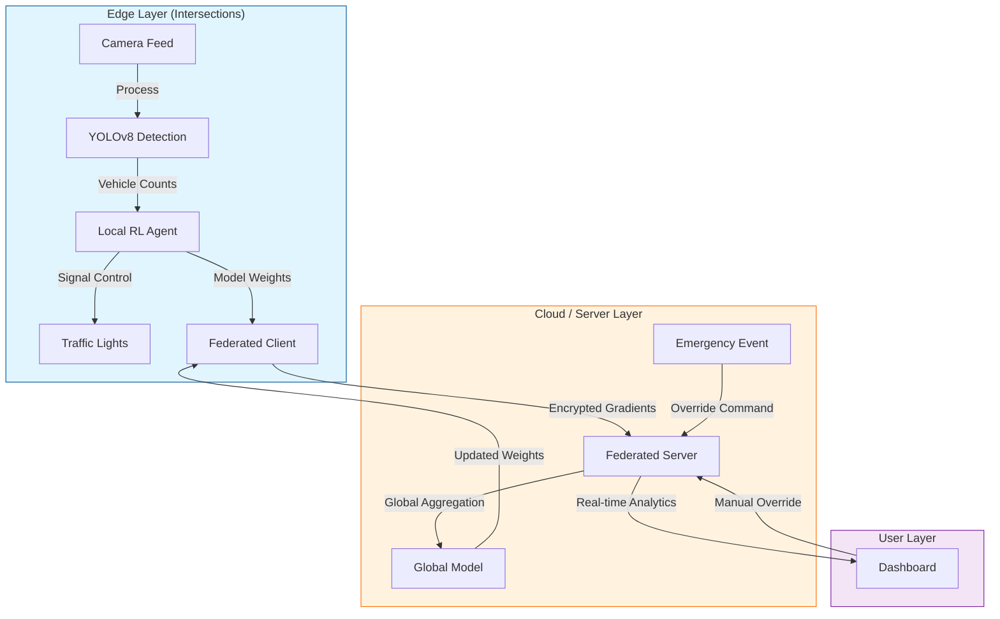

# Vegha: Decentralized Edge-First Traffic Intelligence

> [!IMPORTANT]
> **Hackathon Submission**: This system is designed for **Evaluation Mode**. It prioritizes **Edge Computing**, **Decentralized Intelligence**, and **Brownfield Deployment** over traditional centralized, fiber-heavy approaches.

## � Problem Statement: The Gridlock of Indian Cities

Urban traffic in the Global South is chaotic, unstructured, and rapidly expanding. Existing solutions—Adaptive Traffic Control Systems (ATCS)—fail in this context because:

1.  **Centralization Bottlenecks**: They rely on expensive fiber backhauls to central servers. When the network fails, the city creates gridlock.
2.  **Hardware Dependency**: They require proprietary, high-cost sensors (inductive loops, radar) that are impossible to retrofit on aging infrastructure.
3.  **Latency**: Round-trip time to a cloud server prevents real-time reaction to sudden events (accidents, ambulances).

**Vegha solves this by shifting intelligence to the edge.** We don't just "manage" traffic; we create **Autonomous Intersection Agents** that collaborate to optimize flow without a central brain.

---

## 📉 Why Existing Systems Fail

| Feature | Traditional ATCS | Vegha (Our Solution) |
| :--- | :--- | :--- |
| **Architecture** | Centralized Server (Single Point of Failure) | **Decentralized & Federated** (Fault-Tolerant) |
| **Connectivity** | Requires High-Bandwidth Fiber | **Low-Bandwidth / Intermittent** (4G/LTE/LoRa) |
| **Data Privacy** | Raw Video Streamed to Cloud | **Privacy-Preserving Design** (Only weights shared) |
| **Scalability** | Linear Cost Increase | **Municipal-Scale Deployment** at Fraction of TCO |
| **Deployment** | Years (Digging roads for cables) | **Retrofit-Friendly** (Deploy in weeks) |

---

## 🏗️ System Architecture & Data Flow

Vegha operates on a **Federated Learning** model where each intersection is an independent learner.

### Data Flow Diagram (DFD)

---

## 🧩 Edge-First Decentralized Architecture

Our system runs **100% of critical logic at the edge**.

*   **Autonomous Intersection Agents**: Each junction runs a Raspberry Pi/Jetson Nano with a specialized **PPO (Proximal Policy Optimization)** agent.
*   **Local Inference**: Vehicle detection happens locally using optimized **TensorFlow Lite** models. No video leaves the device.
*   **Fault-Tolerant Architecture**: If the central server goes down, intersections continue to function optimally using their last known policy.

---

## 🔒 Federated Learning & Privacy Preservation

We address the critical challenge of privacy in surveillance.

*   **Privacy-Preserving Design**: Raw footage is processed in RAM and discarded. Only **mathematical model gradients** are transmitted to the server.
*   **Collaborative Intelligence**: Intersections "learn" from each other. A busy intersection teaches a quiet one how to handle a sudden surge, without sharing specific vehicle data.
*   **Low-Bandwidth Communication**: We transmit kilobytes (weights), not Gigabytes (video), making this viable for cellular networks in India.

---

## 🚨 Event-Aware Traffic Intelligence

Vegha goes beyond simple signal timing. It understands context.

*   **Emergency Vehicle Prioritization**: Computer vision detects ambulances/fire trucks and preemptively clears the corridor (Green Wave).
*   **Scheduled Events**: "Coldplay Concert" mode pre-configures routes for massive egress, preventing post-event gridlock.
*   **Road Closures and Diversions**: Operators can mark closed roads on the dashboard, and agents instantly reroute traffic flow logic across the neighborhood.
*   **Graceful Degradation**: In case of camera failure, the system falls back to a robust historical timing profile, ensuring safety.

---

## � Cost & Deployment Economics

*   **Brownfield Deployment**: Works with existing CCTV cameras and signal poles. No need to dig up roads.
*   **Low Total Cost of Ownership (TCO)**:
    *   **Hardware**: Off-the-shelf compute ($100 vs $5000 proprietary controllers).
    *   **Connectivity**: Uses standard 4G SIMs instead of dedicated fiber.
*   **API Monetization**: Anonymized traffic density data is exposed via API for logistics companies, ride-sharing apps, and urban planners.

---

## 📈 Scalability & City-Wide Expansion

*   **Zero-Touch Provisioning**: New intersections are auto-discovered. Just power on the device, and it joins the federated network.
*   **Global South Scalability**: Designed specifically for the chaotic, diverse traffic of Indian cities—handling autos, bikes, and cows with equal precision.
*   **SaaS-Based Analytics**: The command center scales horizontally on the cloud, managing 10 to 10,000 intersections seamlessly.

---

## � Future Scope (Round 2 Improvements)

We have a clear roadmap to move from prototype to pilot.

1.  **LoRaWAN Integration**: Replace 4G with long-range, low-power LoRaWAN for even robust communication in signal-shadow zones.
2.  ** Blockchain for Data Integrity**: Hash traffic logs on an immutable ledger to prevent tampering with violation records.
3.  **V2X Communication**: Direct "Vehicle-to-Infrastructure" talk for autonomous vehicles.
4.  **Real-World Pilot**: Planned deployment at 3 intersections in **[City Name]** to validate TCO savings.

---

## 🏁 Why This System Is Deployable Today

We are not building "scifi". We are building **infrastructure**.
*   **Code is Dockerized** for instant deployment.
*   **Simulations are calibrated** with real-world map data (OpenStreetMap).
*   **Hardware is generic**, removing supply chain risks.

**Vegha is the inevitable future of cost-efficient urban infrastructure.**