# Vegha Server: The Central Nervous System

> [!NOTE]
> This component handles **Orchestration**, **Global Aggregation**, and **API Services**. It does *not* process real-time video; that happens at the Edge.

## 📌 Component Purpose
The Server acts as the **Federated Orchestrator** and **Command Center**. It manages the lifecycle of distributed agents, aggregates learned intelligence, and provides real-time situational awareness to city operators.

## ⚙️ Technical Architecture

### 1. Federated Aggregation Engine
*   **Role**: Receives model weights (gradients) from edge devices.
*   **Algorithm**: Implements **FedAvg (Federated Averaging)** to combine local learnings into a superior global model.
*   **Privacy**: Zero access to raw video footage. Only mathematical parameters are processed.

### 2. Event-Aware Traffic Management
*   **Dynamic Zoning**: Supports creating "Green Corridors" for emergency vehicles in real-time.
*   **Incident Response**: Push-button logic to trigger "Road Closure" protocols, instructing edge agents to divert traffic.
*   **Scheduled & Unscheduled Events**: Pre-loaded configurations for daily peak hours vs. one-off events (concerts, VIP movement).

### 3. Fault-Tolerance & Reliability
*   **Heartbeat Monitoring**: Tracks the health of every edge node.
*   **Graceful Degradation**: If an edge node goes silent, the server alerts maintenance teams while the node autonomously falls back to safety modes.

## 🔄 Interaction Flow (Sequence Diagram)

```mermaid
sequenceDiagram
    participant Edge as Edge Agent (Junction)
    participant Server as Federated Server
    participant DB as Event Log
    participant Admin as Dashboard User

    Edge->>Server: Heartbeat (Status: OK, Q-Len: 45)
    
    rect rgb(255, 230, 230)
        Note over Edge: 🚑 Emergency Vehicle Detected
        Edge->>Server: ALERT_EMERGENCY (Type: Ambulance)
        Server->>DB: Log Event
        Server->>Admin: Push Notification (Urgent)
        Admin->>Server: Confirm "Green Corridor"
        Server->>Edge: COMMAND_OVERRIDE (All Red -> Green Wave)
    end
    
    rect rgb(230, 255, 230)
        Note over Edge, Server: 🧠 Federated Learning Round
        Edge->>Server: Upload Local Weights
        Server->>Server: Average Weights (FedAvg)
        Server->>Edge: Broadcast Global Model
    end
```

## 💰 Contribution to Business Metrics
*   **SaaS-Based Analytics**: The backend provides the APIs needed to monetize traffic data (e.g., selling density maps to logistics firms).
*   **Scalability**: Stateless architecture allows the server to handle 10,000+ connections with minimal hardware.
